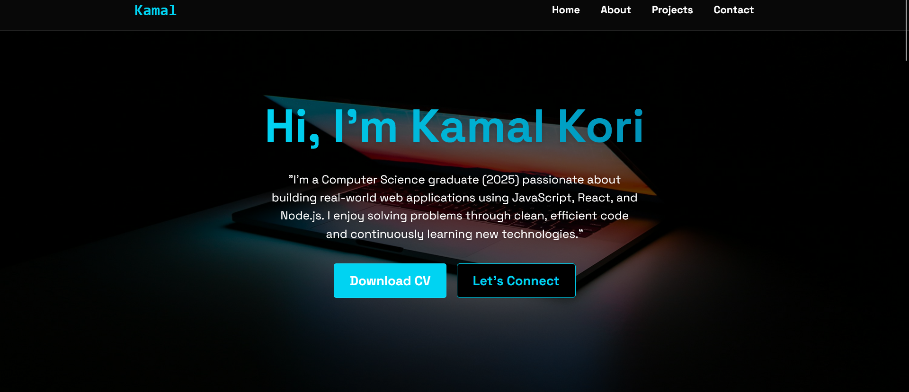
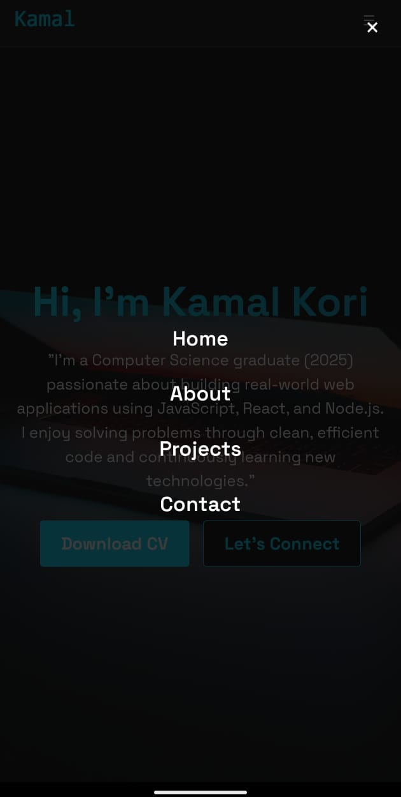

<h1 align="center">🚀 My React Portfolio</h1>

<p align="center">
  
</p>

<p align="center">
  🌐 A responsive and modern portfolio website built using <strong>React</strong>, <strong>Vite</strong>, and custom CSS.<br>
  Perfect for showcasing my skills, projects, and contact information.
</p>

---

## 📍 Live Demo

👉 **[Visit Now](https://kamalport28.vercel.app/)**

---

## 🛠️ Tech Stack

**Frontend:**  


**Build Tools & Deployment:**  


---

## 📸 Screenshots

| Desktop View | Mobile View |
|--------------|-------------|
|  |  |

---

## ✨ Features

✅ Responsive Design (Mobile + Desktop)  
✅ Modern UI with animations & hover effects  
✅ Portfolio sections – About, Skills, Projects, Contact  
✅ Fast build & deployment (Vite + Vercel)  
✅ Modular & clean React component structure  

---

## 🚀 Getting Started

To run this project locally:

```bash
# Clone the repo
git clone https://github.com/kamalkori28/MyPortfolio.git

# Navigate to the folder
cd MyPortfolio

# Install dependencies
npm install

# Start the development server
npm run dev
